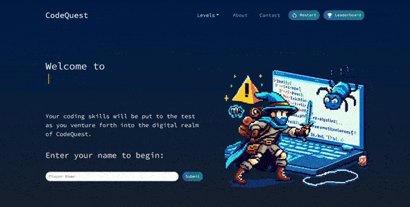
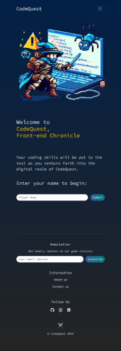

# CodeQuest

## Module 14 Final Project

## Table of Contents

- [Overview](#overview)
- [Screenshots](#screenshots)
- [Links](#links)
- [Our Process](#our-process)
- [Built With](#built-with)
- [Authors](#authors)
- [Credits](#credits)

## Overview
The game is an interactive learning platform providing a gamified approach to programming education. 

User Story: CodeQuest is designed to help players learn to code through fun and engaging games. Our mission is to make coding education accessible and enjoyable for everyone, regardless of their experience level. Whether you're a beginner just starting your coding journey or an experienced developer looking to enhance your skills, CodeQuest offers a wide range of interactive challenges and tutorials to suit your needs. Join us on this exciting quest to master the art of coding!

## Screenshots

### Desktop:
 
### Mobile:

### Links

- [GitHub Repo](https://github.com/AoifeEdX/code-quest)
- [Live Link](https://codequest-game.netlify.app/)
- Presentation Slides:
	- [PPTX](https://github.com/AoifeEdX/code-quest/blob/main/public/assets/Presentation_CodeQuest.pptx)
	- [PDF](https://drive.google.com/drive/folders/1FrdpjjQbhZp4Ytr-1pLShFzUMCLSLHi_?usp=drive_link)

## Our Process

In this project work, we created three different levels with different design and approach, using react libraries and react bootstrap for design. 

It has a GitHub Explorer feature to find intersting repos based on the programmin language of your choice.

It has a Video Courses feature offering a collection of web and mobile development courses and tutorials from Internet Archive.

Meeting the bootcamp requirements we used more libraries (see listed below) and Supabase to store data that are displayed in leaderboard. 

### Built With

### Libraries

- Bootstrap [npm package](https://www.npmjs.com/package/bootstrap)
- Fontsource
- Material UI Icons [npm package](https://www.npmjs.com/package/@mui/icons-material)
- Popper.js [npm package](https://www.npmjs.com/package/@popperjs/core)
- React Bootstrap [npm package](https://www.npmjs.com/package/react-bootstrap)
- React Hot Toast [npm package](https://www.npmjs.com/package/react-hot-toast)
- React Router Dom [npm package](https://www.npmjs.com/package/react-router-dom)
- React Toastify [npm package](https://www.npmjs.com/package/react-toastify)
- Supabase [supabase.com](https://supabase.com/toas)
- Typewriter Effect [npm package](https://www.npmjs.com/package/typewriter-effect)
- UUID [npm package](https://www.npmjs.com/package/uuid)

## Authors

- Adebayo Dada
  - [GitHub](https://github.com/AOD4141)
  - [LinkedIn](https://www.linkedin.com/in/adebayodada/)

- Aoife Dunphy
  - [GitHub](https://github.com/AoifeEdX)
  - [LinkedIn](https://www.linkedin.com/in/aoifenidhonnacha/)

- Szilvia Horvath
  - [GitHub](https://github.com/hszilvi)
  - [LinkedIn](https://www.linkedin.com/in/horvathszilvi/)

- Olha Pobedynska
  - [GitHub](https://github.com/23birola)
  - [LinkedIn](https://www.linkedin.com/in/olga-pobedynska-a79492220/)

### Credits

<b>Resources</b>

- Internet Archive API
- GitHub Languages API
- Google Script API
- Supabase SQL

